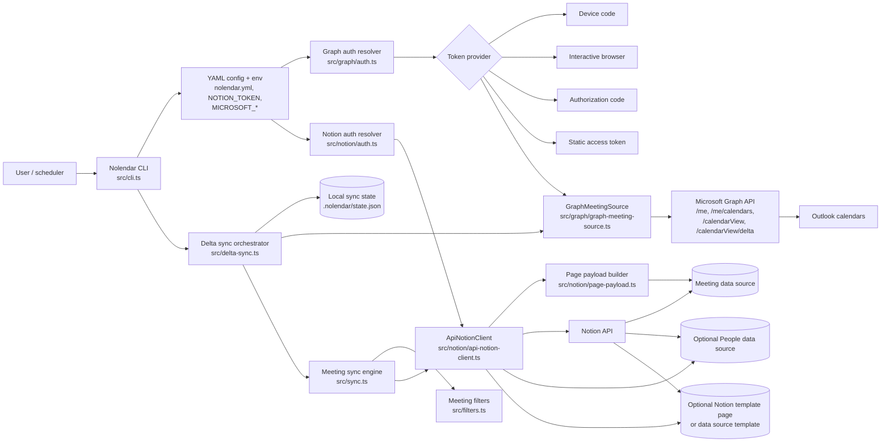

# Nolendar Architecture

Nolendar is a TypeScript CLI that reads Outlook calendar events through Microsoft Graph and writes structured meeting pages into Notion. It keeps a local delta-sync state file so repeated runs only process changed or removed calendar events when the Graph delta link is still valid for the configured lookahead window.

## Integration Architecture

## Overall Process Flow

```mermaid
flowchart TD
  start([Run nolendar sync]) --> loadConfig[Load and normalize config]
  loadConfig --> resolveWindow[Resolve lookahead window]
  resolveWindow --> buildClients[Build Graph source and Notion client]
  buildClients --> validateSchema[Validate or optionally ensure Notion schema]
  validateSchema --> loadState[Load .nolendar/state.json]
  loadState --> calendarLoop{For each configured calendar}

  calendarLoop --> reuseDelta{Saved delta link matches<br/>lookahead and window?}
  reuseDelta -- yes --> callDelta[Call Microsoft Graph<br/>saved deltaLink]
  reuseDelta -- no --> callFreshDelta[Call Microsoft Graph<br/>calendarView/delta for window]
  callDelta --> processDelta[Collect changed events,<br/>removed event IDs, next deltaLink]
  callFreshDelta --> processDelta

  processDelta --> removedLoop{Removed event IDs?}
  removedLoop -- yes --> findRemoved[Find Notion page by Outlook Event ID]
  findRemoved --> archiveRemoved{Page found?}
  archiveRemoved -- yes --> archivePage[Archive Notion page]
  archiveRemoved -- no --> storeDelta[Store next deltaLink in memory]
  archivePage --> storeDelta
  removedLoop -- no --> storeDelta

  storeDelta --> moreCalendars{More calendars?}
  moreCalendars -- yes --> calendarLoop
  moreCalendars -- no --> sortMeetings[Flatten and sort changed meetings]

  sortMeetings --> meetingLoop{For each meeting}
  meetingLoop --> filterMeeting{Passes filters?}
  filterMeeting -- no --> filtered[Count filtered]
  filterMeeting -- yes --> findExisting[Query Notion by Outlook Event ID]

  findExisting --> exists{Existing page?}
  exists -- no --> cancelledNew{Meeting cancelled?}
  cancelledNew -- yes --> skipped[Count skipped]
  cancelledNew -- no --> createPage[Create Notion meeting page<br/>with properties, links, sections,<br/>icon, tags, assignee, participants]

  exists -- yes --> cancelledExisting{Meeting cancelled?}
  cancelledExisting -- yes --> archiveExisting[Archive existing Notion page]
  cancelledExisting -- no --> changed{changeKey changed<br/>or force-update?}
  changed -- no --> skipped
  changed -- yes --> updatePage[Update Notion page properties,<br/>icon, assignee, participants]

  createPage --> maybePeople[Resolve/create People pages<br/>when participant relation is configured]
  updatePage --> maybePeople
  maybePeople --> nextMeeting[Next meeting]
  filtered --> nextMeeting
  skipped --> nextMeeting
  archiveExisting --> nextMeeting

  nextMeeting --> moreMeetings{More meetings?}
  moreMeetings -- yes --> meetingLoop
  moreMeetings -- no --> dryRun{Dry run?}
  dryRun -- yes --> summary[Print sync summary]
  dryRun -- no --> saveState[Save updated delta links<br/>to .nolendar/state.json]

  saveState --> nativeTemplate{Native data source<br/>template configured?}
  nativeTemplate -- no --> summary
  nativeTemplate -- yes --> delay[Wait finalize delay]
  delay --> relist[List current meetings]
  relist --> finalize[Append generated Nolendar sections<br/>if template page lacks them]
  finalize --> summary
  summary --> done([Done])
```

